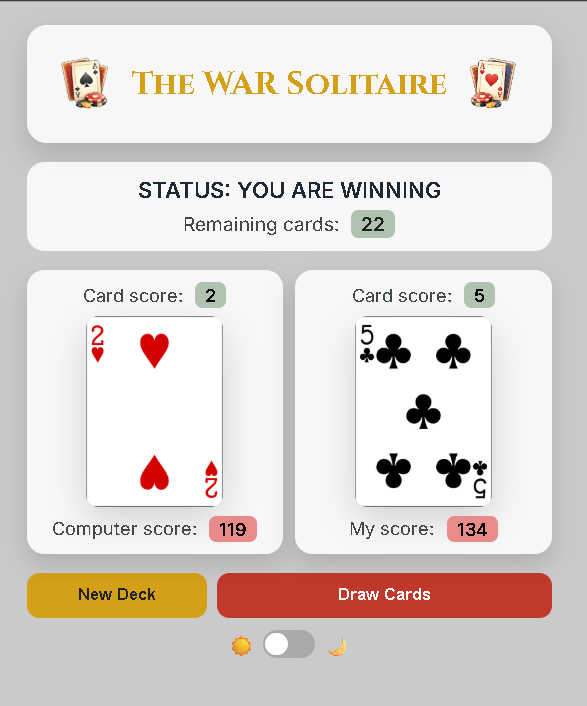
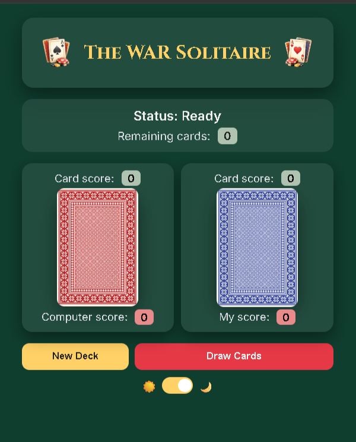

# 🎴 The WAR Solitaire

A modern, interactive card game built using the **Deck of Cards API**, featuring a clean UI, dark/light themes, and dynamic gameplay.

---

## 🚀 Live Preview

> *Not yet available*

---

## 📸 Screenshots

### 🌞 Light Mode



### 🌙 Dark Mode



---

## 🎮 Features

* 🃏 Draw cards using real API data
* ⚔️ WAR-style card comparison logic
* 📊 Live score tracking (per round + total)
* 🎯 Status updates (Winning / Losing / Tie)
* 🌗 Light & Dark theme toggle
* ✨ Smooth UI feedback (hover, animations, highlights)
* 📉 Remaining deck counter
* 🚫 Auto-disable when deck is finished

---

## 🧠 Game Logic

* Each round draws **2 cards**
* Card values are compared:

  * Higher value wins the round
  * Equal values trigger a tie ("WAR")
* Scores are updated dynamically
* Game ends when no cards remain

---

## 🛠️ Tech Stack

* **HTML5**
* **CSS3 (Custom Properties / Variables)**
* **JavaScript (ES6+)**
* **Deck of Cards API**

---

## 📂 Project Structure

```bash
📁 deck-of-cards-the-war-project
│
├── 📁 images
├── 📁 screen-recording
├── 📁 screenshots
├── index.html
├── index.css
├── index.js
└── README.md
```

---

## ⚙️ Setup & Installation

1. Clone the repository:

```bash
git clone https://github.com/your-username/deck-of-cards-the-war-project.git
```

2. Open the project folder:

```bash
cd deck-of-cards-the-war-project
```

3. Run the project:

* Open `index.html` in browser
  OR
* Use Live Server (recommended)

---

## 🔌 API Used

* [Deck of Cards API](https://deckofcardsapi.com/)

---

## 🎯 Learning Outcomes

This project helped me improve:

* Working with **APIs (fetch / async-await)**
* DOM manipulation
* State management in JavaScript
* Building **theme systems (light/dark)**
* UI/UX design thinking
* Structuring scalable CSS using variables

---

## ✨ Future Improvements

* 🔄 Add full WAR mode (tie → multiple draws)
* 🎞️ Card flip animations
* 🧑‍🤝‍🧑 Multiplayer support
* 📱 Fully responsive mobile layout
* 🔊 Sound effects

---

## 👤 Author

**Fakhar Alam**

* 🔗 LinkedIn: [https://www.linkedin.com/in/fakhar-e-alam-a046133b4/](https://www.linkedin.com/in/fakhar-e-alam-a046133b4/)
* 💻 Scrimba Profile: [https://scrimba.com/?via=u43a7734](https://scrimba.com/?via=u43a7734)

---

## 📢 Note

I’m currently learning **Full Stack Development from Scrimba**.
You can join using my link and start your journey too:

👉 [https://scrimba.com/?via=u43a7734](https://scrimba.com/?via=u43a7734)

---

## ⭐ Support

If you like this project:

* ⭐ Star the repo
* 🍴 Fork it
* 🧠 Suggest improvements

---
